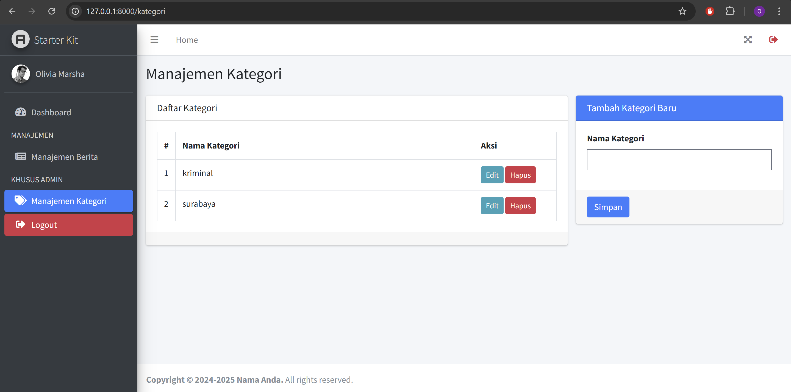
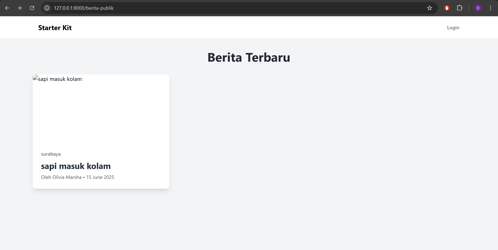
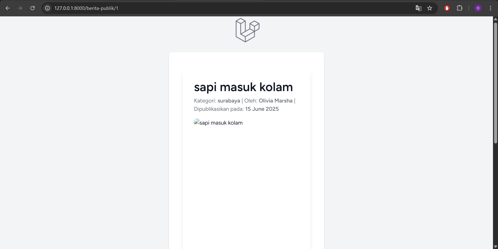
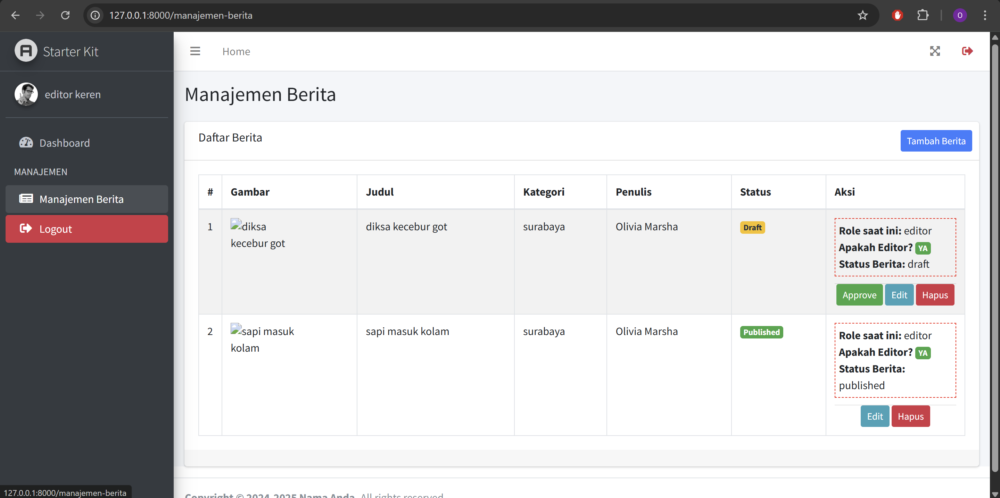

- Access the public news listing at `/berita-publik`.
- Login to manage news articles.
- Upload images when creating or editing news articles. Images are stored in `storage/app/public/berita`.
- Images are served via the symbolic link `public/storage`.
=======

## Usage

- Access the public news listing at `/berita-publik`.
- Login to manage news articles.
- Upload images when creating or editing news articles. Images are stored in `storage/app/public/berita`.
- Images are served via the symbolic link `public/storage`.

## Tampilan Web

Aplikasi web ini memiliki beberapa tampilan utama yang mendukung pengelolaan dan publikasi berita:

- **Halaman Daftar Berita Publik** (`/berita-publik`): Menampilkan daftar berita yang dapat diakses oleh semua pengguna.
- **Halaman Detail Berita**: Menampilkan isi lengkap dari sebuah berita yang dipilih.
- **Dashboard Admin**: Halaman utama untuk admin mengelola konten berita dan kategori.
- **Halaman Manajemen Berita**: Termasuk halaman untuk membuat, mengedit, dan menghapus berita.

Tampilan antarmuka menggunakan **Tailwind CSS** untuk memastikan responsivitas dan kemudahan penggunaan pada berbagai perangkat. Struktur layout dibangun dengan menggunakan Blade templates Laravel, dengan komponen navigasi seperti navbar dan sidebar untuk memudahkan navigasi antar halaman.

## Gambar Tampilan Web

Berikut adalah beberapa gambar yang menggambarkan tampilan utama aplikasi web:

### Dashboard Admin

### Daftar Berita Publik

### Detail Berita

### Manajemen Berita

